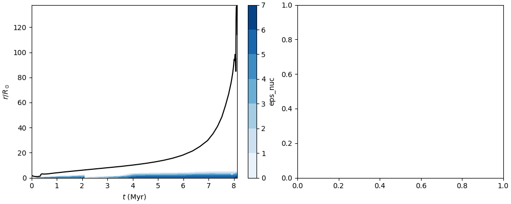

# mkipp
Kippenhahn plotter for MESA. BEWARE: this README might be out of date! In case the examples don't work refer to the example.py file in the repository.

!!!!!!!!!!!!!!!!!!!!!!!!!!!!!!!!!!!!!!!!!!!!!!!!!!!!

IMPORTANT!! your history_columns.list needs to have mixing_regions and mix_relr_regions specified for MESA to output the neccesary data of the mixing regions.

!!!!!!!!!!!!!!!!!!!!!!!!!!!!!!!!!!!!!!!!!!!!!!!!!!!!

The Kippenhahn plotter consists of 3 files:
- mesa_data.py: a simple parser of MESA data files that only parses specific columns to save time
- kipp_data.py: process data for Kippenhan plot
- mkipp.py: the Kippenhahn plotter
 
Although lower-level functions are provided that allow plotting directly into a matplotlib axis object, a high level function produces a fully decorated plot. The repository comes with some sample MESA data for a 20 Msun star, which if used with the following python script
```python
import mkipp
mkipp.kipp_plot(mkipp.Kipp_Args())
```
results in the following plot


Several options can be passed to mkipp.Kipp_Args():
```python
#properties of the plotter
class Kipp_Args:
    def __init__(self,
            logs_dirs = ['LOGS'],
            profile_names = [],
            history_names = [],
            identifier = "eps_nuc",
            extractor = default_extractor,
            log10_on_data = True,
            contour_colormap = plt.get_cmap("Blues"),
            levels = [],
            log_levels = True,
            num_levels = 8,
            xaxis = "model_number",
            xaxis_divide = 1.0,
            time_units = "Myr",
            yaxis = "mass",
            yaxis_normalize = False,
            show_conv = True, show_therm = True, show_semi = True, show_over = True, show_rot = False,
            core_masses = ["He","C","O"],
            yresolution = 1000,
            mass_tolerance = 0.0000001,
            radius_tolerance = 0.0000001,
            decorate_plot = True,
            show_plot = False,
            save_file = True,
            save_filename = "Kippenhahn.png"):
        """Initializes properties for a Kippenhahn plot
        Note:
            All arguments are optional, if not provided defaults are assigned
        Args:
            logs_dir (List[str]): List of paths to MESA LOGS directories. If profile_names and
                history_names are not provided, they are automatically generated from logs_dir.
            profile_names (List[str]): List of paths to MESA profile files.
            history_names (List[str]): List of paths to MESA history files.
            identifier (str): String used as identifier of data to plot. If not using any custom
                extractors this is simply the column name in the profile file that will be extracted.
                Default uses eps_nuc.
            extractor : TODO, explain
            log10_on_data (bool): Determines if log10(abs()) is applied to profile data
            contour_colormap (matplotlib.cm): matplotlib color map used to plot contours
            levels (List): List of fixed levels for contour plot (int or float)
            log_levels (bool): if levels is an empty list then they are auto-generated. This
                variable specifies if the date is the log of a quantity or not, in order to
                produce discrete integer levels.
            num_levels (int): Number of automatically generated levels
            xaxis (str): variable for the xaxis, either "model_number" or "star_age"
            xaxis_divide (float): divide xaxis by this value
            time_units (str): When using xaxis = "star_age" this specifies the unit of time
                and sets the value of xaxis_divide. Options are "yr", "Myr" and "Gyr"
            yaxis (str): Quantity plotted in the yaxis. Either "mass" or "radius"
            yaxis_normalize (bool): If True Normalize yaxis at each point using total mass/total radius
            show_conv, show_therm, show_semi, show_over, show_rot (bool): Specifies whether or
                certain mixing regions are displayed.
            core_masses (List(str)): Strings with core masses to plot. Options are "He", "C" and "O".
                Only for yaxis=mass
            yresolution (int): resolution for contour plotting
            mass_tolerance (float): ignore mixing regions smaller than this in solar masses. Ignored
                if yaxis="radius"
            radius_tolerance (float): ignore mixing regions smaller than this in solar radii. Ignored
                if yaxis="mass"
            decorate_plot (bool): If True, then axis labels are included.
            show_plot (bool): If True, pyplot.show() is ran at the end
            save_file (bool): If True, plot is saved after pyplot.show()
            save_filename (str): Filename to save plot. Extension determines filetype.
        """
```

Also a matplotlib axis object can be passed to kipp_plot. This allows plot decorations to be made independently, or can be also used to make a plot with many different Kippenhahn plots. As an example, the following plots evolution of Helium abundance with respect to time for the same model as before
```python
import mkipp
import matplotlib.pyplot as plt
import numpy as np
#plot of Helium abundance against time, independent decoration
fig = plt.figure()
axis = plt.gca()
contour_plot, histories, xlims = mkipp.kipp_plot(mkipp.Kipp_Args(
        xaxis = "star_age",
        time_units = "Myr",
        identifier = "y",
        log10_on_data = False,
        levels = np.arange(0.0,1.001,0.01),
        decorate_plot = False,
        save_file = False), axis = axis)
bar = plt.colorbar(contour_plot,pad=0.05)
bar.set_label("Helium abundance")
axis.set_xlabel("Time (Myr)")
axis.set_ylabel("Mass (solar masses)")
plt.savefig("Kippenhahn2.png")
```
which results in the following plot


The data from mixing regions and profiles can be extracted using lower level functions and plotted in an arbitrary form. The following is an (ugly) example:

```python
import mkipp
import kipp_data
import matplotlib.pyplot as plt
from matplotlib.patches import PathPatch
import numpy as np
#Reading out mixing regions and data, and plotting independently
kipp_args = mkipp.Kipp_Args()
fig = plt.figure()
axis = plt.gca()
profile_names = ["LOGS/profile"+str(int(i))+".data" \
        for i in np.loadtxt("LOGS/profiles.index", skiprows = 1, usecols = (2,))]
#if data is distributed among several history.data files, you can provide them
history_names = ["LOGS/history.data"]
#read profile data
min_x_coord, max_x_coord, X, Y, Z = \
        kipp_data.get_xyz_data(profile_names, kipp_args.xaxis_divide, kipp_args)
#read mixing regions 
zones, mix_types, x_coords, y_coords, histories = kipp_data.get_mixing_zones(\
        history_names, kipp_args.xaxis_divide, min_x_coord, max_x_coord, kipp_args)
# just plot convection, overshooting and semiconvection
for i,zone in enumerate(zones):
    color = ""
    #Convective mixing
    if mix_types[i] == 1: #convection
        color = '#332288'
    #Overshooting 
    elif mix_types[i] == 3: #overshooting
        color = '#117733'
    #Semiconvective mixing
    elif mix_types[i] == 4: #semiconvection
        color = '#CC6677'
    else:
        continue
    axis.add_patch(PathPatch(zone, color=color, alpha = 0.5, lw = 0))
CS = plt.contour(X, Y, Z, [0,4,8], colors='k')
plt.clabel(CS, inline=1, fontsize=10)
axis.plot(x_coords,y_coords,'k',lw=4)
axis.set_xlabel("model_number")
axis.set_ylabel("Mass (solar masses)")
axis.set_xlim(0,max(x_coords))
axis.set_ylim(0,max(y_coords))
plt.savefig("Kippenhahn3.png")
```
which gives the following ugly result (just an example!)

